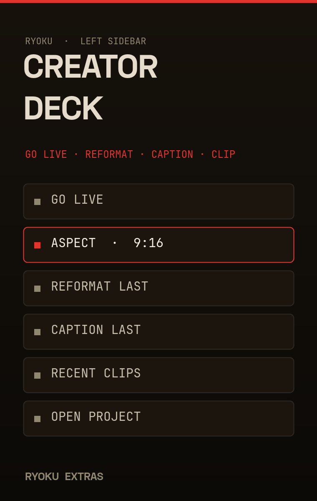

# Creator Deck

A creator cockpit that mounts as a tab in the **left sidebar**, beside Stash
(reveal it with `SUPER+D`). Built for streamers and video makers, it turns the
record -> reformat -> caption -> publish loop into one-tap actions.



## What it does

- **Go live / Edit** launch OBS (start streaming if configured) or your editor
  (kdenlive, DaVinci, Shotcut, LosslessCut, whichever is installed).
- **Aspect target** pick 9:16 / 1:1 / 16:9; the choice drives both *Reformat
  last recording* and the right-click **Video Reformat** Nautilus scripts, so
  capture and export stay in the same frame.
- **Reformat last recording** crop the newest clip in `~/Videos/Recordings` to
  the aspect target and reveal it in the file manager.
- **Caption last recording** transcribe the newest clip to a sidecar `.srt`
  with whisper.cpp.
- **Mic** mute/unmute the default source (turns red when muted); **Effects**
  toggle the EasyEffects chain.
- **Free for recordings** live disk headroom for the recordings folder.
- **Recent** the newest clips; tap to reveal in Nautilus.
- **Open project folder** jump to your working set.

## How it plugs in

Creator Deck is a `sidebarLeft`-host plugin: it ships a `content/Widget.qml`
(this pane), a `service/Main.qml` (polls state, fires actions), and a
`bin/ryoku-creator-deck` engine. The shell owns the sidebar, its reveal, and the
tab rail; the deck just draws its pane and calls the engine. It is installed by
the **Influencer** bundle and auto-enabled, so the tab appears on install with no
setup; removing the bundle removes it and its state cleanly.

## Depends on

Actions call tools the Influencer bundle installs: `obs`, `kdenlive`, `ffmpeg`,
`whisper.cpp`, `easyeffects`, plus `wpctl` (PipeWire) and `nautilus` from the
base desktop. Missing tools degrade gracefully with a notification.

## Develop

```
plugins/creator-deck/
  manifest.json            hosts: ["sidebarLeft"], commands, defaults
  service/Main.qml         state + action dispatch (pluginApi.mainInstance)
  content/Widget.qml       the pane (tiles, chips, recents)
  bin/ryoku-creator-deck   the engine (status JSON + action verbs)
  assets/preview-popout.png
```

## Credits

Ryoku Team. GPL-3.0-or-later.
