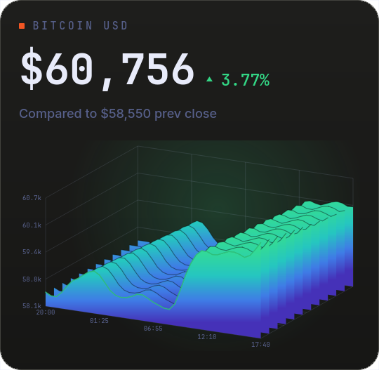

# Market

Track a watchlist of stocks, indices, and crypto pairs on your desktop.



## What it does

- Tracks a **watchlist** of up to six [Yahoo Finance](https://finance.yahoo.com)
  symbols - crypto pairs (`BTC-USD`), stocks (`AAPL`, `F` for Ford), indices
  (`^GSPC`), even futures (`GC=F`). No API key. Type them right on the tile:
  hover for the **`$`** button, enter a comma-separated list (a leading `$`
  like `$SPY` is fine), press Enter.
- One symbol is the **active** instrument: it owns the chart and the headline
  price. The rest ride along as compact rows - symbol, mini sparkline, price,
  change - and a tap on any row promotes it to the chart.
- Switch the timeframe **on the tile**: the `1D 1W 1M 1Y` chips in the header.
  The chart, the change badge, and the "compared to" baseline all follow the
  window - for 1D the baseline is the previous close, for wider windows the
  first sample of the window, so the number always describes the chart under it.
- Four **faces**, chosen by a setting, each drawn in the shell's dark
  carbon-dossier style:
  - **Dossier** - the flagship: a big tabular price, the change badge, the
    "compared to" baseline, a **3D ridgeline** of the price history with
    numbered axes, and the watchlist rows underneath.
  - **Line** - a smooth line over an optional grid, with price/time axes and an
    end-point marker.
  - **Area** - a smooth line over a trend-tinted gradient fill, with axes.
  - **Minimal** - one symbol: name, price, change, sparkline. A watchlist: the
    ticker board, one row per instrument. The smallest.
- **Hover the chart** for a crosshair readout of the exact price and time at
  the nearest sample (Line and Area faces).
- Honest states, always: an em-dash and a `FETCHING` pulse before the first
  quote (never a fake `$0.00`), the error and a "retries every Ns" note when a
  symbol has no data, a gold **STALE** flag when a refresh fails while old
  numbers are still showing, and an `AS OF HH:MM` stamp plus a session dot
  (open / closed / pre / after-hours) on everything fetched.
- Rising is green, falling is vermilion, **always** - the trend colours are
  fixed regardless of the wallpaper, and the `accent` setting only tints chrome
  (the window chips, the active-row tick, the refresh dot).

## Install

**Ryoku Settings -> Plugins -> Discover -> Market -> Install**, then enable it.
Drag it where you like and scale it from the corner bracket, same as the clock.
Hover the tile and click the **`$`** button to type the watchlist; the design,
window, and other options live in the tile's right-click menu.

## How it plugs in

The shell owns the draggable card, the motion, and the placement; the plugin
supplies the quotes and the chart. It ships three parts:

- `service/Main.qml` - resolves settings, polls the fetch script on a timer,
  and exposes the parsed quotes + history (active symbol flattened for the
  faces, the full watchlist as rows). It loads once and keeps its state while
  the tile is hidden. (`main` entry point.)
- `content/Widget.qml` - the face selector plus the watchlist editor; mounts
  one face per the `design` setting. (`content` entry.)
- `bin/ryoku-market-fetch` - the small CLI that talks to the Yahoo Finance API
  (needs `curl` and `jq`). One call fetches the whole watchlist: the first
  symbol at full resolution, the rest downsampled for the row sparklines.

Symbols, window, and the active instrument persist to `plugins.json` via
`ryoku-plugins-place`; the shell watches that file, so every surface follows
live.

## Settings

The watchlist is typed on the tile (the `$` button) and the window is switched
by its header chips; everything is also editable from the tile's right-click
menu (chips, switch, slider) and the hub form.

| Setting      | Default   | What it does                                             |
| ------------ | --------- | ------------------------------------------------------- |
| `design`     | `dossier` | Which face: dossier / line / area / minimal             |
| `symbols`    | `BTC-USD` | The watchlist: comma-separated Yahoo tickers, up to six |
| `window`     | `1D`      | History window: 1 day / week / month / year             |
| `refreshSec` | `60`      | Poll interval in seconds (30 - 600)                     |
| `accent`     | `wallust` | Chrome tint: follow wallpaper / brand / mono            |
| `showGrid`   | `true`    | Draw the grid behind the Line and Area faces            |

(The active symbol is tile state, persisted as `active` alongside the settings;
a legacy single `symbol` value still resolves as a one-entry watchlist.)

## Develop

```
market/
  manifest.json                 id, version, entry points, desktopWidget host, settings
  service/Main.qml              main: resolve settings + poll fetch + quotes/rows state
  content/Widget.qml            content: face selector + watchlist editor
  content/MarketDossier.qml     face: hero price + 3D ridgeline + watch rows
  content/MarketLine.qml        face: gridded line + axes + crosshair
  content/MarketArea.qml        face: line + gradient fill + axes + crosshair
  content/MarketMinimal.qml     face: compact quote row, or the ticker board
  content/Ridgeline.qml         part: the 3D ridgeline surface + axes
  content/Sparkline.qml         part: compact polyline
  content/ChangeBadge.qml       part: arrow + percent, hover reveal
  content/PriceText.qml         part: big tabular price, flash on change
  content/WindowChips.qml       part: the 1D/1W/1M/1Y switcher
  content/WatchRows.qml         part: the watchlist rows
  content/MetaLine.qml          part: session dot + as-of + stale flag
  content/FacePlaceholder.qml   part: fetching/error placeholder
  content/Crosshair.qml         part: chart hover readout
  bin/ryoku-market-fetch        the Yahoo Finance CLI (batch, watchlist-aware)
  assets/preview-widget.png     the README image
```

## Credits

Official Ryoku plugin, MIT-licensed. Quote and history data from
[Yahoo Finance](https://finance.yahoo.com).
