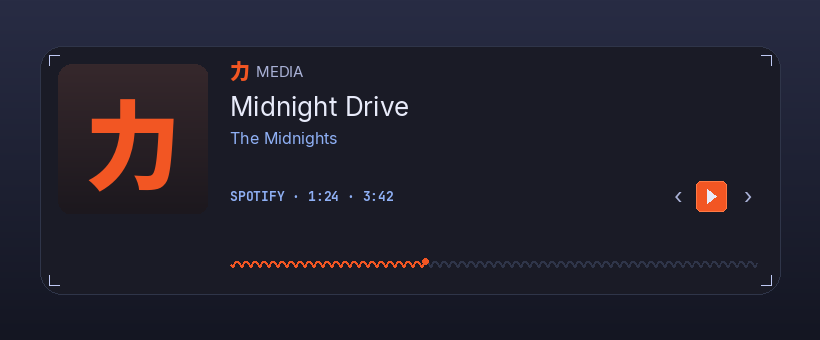

# Media

Now-playing on your desktop, in seven faces.



A desktop-widget plugin for the Ryoku shell: it reads your active media player
(any MPRIS source - Spotify, a browser, `mpv`, `playerctl`...) and renders it as
one of seven selectable **faces**, each drawn in the shell's own carbon-dossier
style and customizable. Drag, resize, and place it on your wallpaper beside the
clock and weather; it shows a bundled sample so it looks right the moment you
enable it.

## The faces

Pick one in the plugin settings (`design`):

- **Dossier** - the shell-native baseline: album art, a 力 MEDIA eyebrow, title
  and artist, a mono `source · position · length` line, play/skip controls, and
  the Ryoku-wave seek line.
- **Minimal** - a compact one-liner: thumbnail, scrolling title, a thin wave, and
  play/pause. For when you want it small.
- **Poster** - the album art full-bleed, with an info scrim and the same colour
  filters as Photo Frame (mono, noir, sepia, warm, cool, vivid, fade).
- **Vinyl** - the art as a spinning record with a tonearm that lifts when you
  pause. Optional radial spectrum ring.
- **Cassette** - a tape deck whose reels spin while the track plays.
- **Loop** - a looping GIF backdrop (yours, or the bundled sample) with a
  translucent now-playing overlay.
- **Spectrum** - a live **CAVA** audio spectrum as the hero, with a compact strip
  on top.

CAVA also appears, opt-in, on Vinyl (ring), Poster (strip), and Loop (overlay) -
turn on **Spectrum overlay**. CAVA is a soft dependency: without the `cava`
binary the spectrum simply renders flat, and nothing else is affected.

## Light on resources

Everything that moves is gated on playback: the GIF, the vinyl/cassette spin, the
seek wave, and the cava process all stop when the track is paused, and the album
art decodes only at the size it is shown. On top of that, the shell parks the
whole desktop-widget layer when every screen is covered (Settings → Performance →
Desktop Widgets), so an idle, hidden widget costs nothing.

## Settings

| Setting | What it does | Default |
| --- | --- | --- |
| `design` | Which face to show (the seven above) | `dossier` |
| `accent` | Accent source: `wallust` (from the wallpaper), `brand`, or `mono` | `wallust` |
| `showSource` | Show the mono source/time line | `true` |
| `showSeek` | Show the wave seek line | `true` |
| `artRadius` | Corner roundness of the album art / poster / loop tile | `14` |
| `posterFilter` | Colour filter for the Poster face | `none` |
| `gifPath` | GIF for the Loop face; blank uses the bundled sample | `""` |
| `spectrumOverlay` | Show the CAVA spectrum on Vinyl / Poster / Loop | `false` |
| `spectrumBars` | Number of CAVA bands | `48` |

Placement, size, and the card background are owned by the desktop (drag to move,
the corner bracket to resize, right-click for the menu).

## Develop

```
media/
  manifest.json            id, version, entry points, desktopWidget host, settings
  service/
    Main.qml               resolves settings + picks the active MPRIS player (with defaults)
    Spectrum.qml           the cava process wrapper, gated to playback
  content/
    Widget.qml             the adaptive view: selects one face by `design`
    MediaDossier.qml  MediaMinimal.qml  MediaPoster.qml
    MediaVinyl.qml    MediaCassette.qml MediaLoop.qml  MediaSpectrum.qml
    Marquee.qml  Transport.qml  WaveSeek.qml  SpectrumBars.qml  SpectrumRing.qml
  assets/
    sample.gif             the bundled Loop default
    cover.jpg              album-art fallback
    preview-widget.png     catalogue preview
```

## Credits

Built by the Ryoku team. CAVA spectrum by [cava](https://github.com/karlstav/cava).
The looping-GIF face takes its cue from the caelestia shell's media dashboard.
