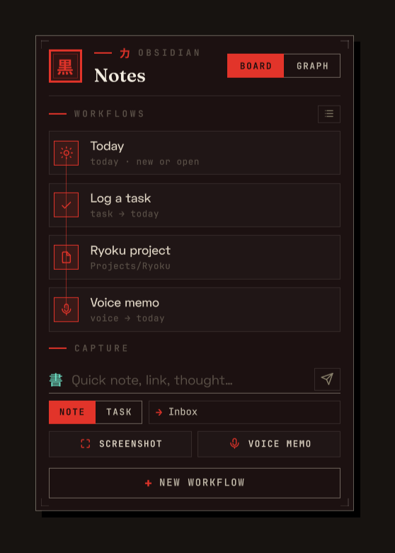
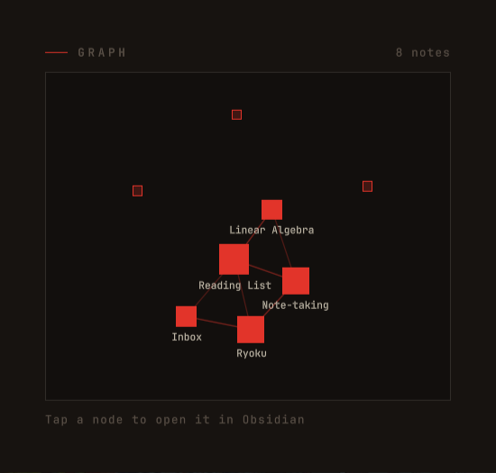

# Obsidian

Quick-capture into your Obsidian vault, right from the desktop.





## What it does

Adopts your existing Obsidian vault and settings, then turns the everyday
capture moves into a **Board** of tappable workflow blocks and a **Graph** of
your vault, in the shell's dark carbon-dossier style. A `Board | Graph` switch
sits under the masthead.

- **Detects Obsidian and your vaults.** Finds the binary and reads the vaults
  Obsidian already knows (`~/.config/obsidian/obsidian.json`). Pick one on the
  tile; nothing happens until you do.
- **Respects your settings.** Reads each vault's `.obsidian/daily-notes.json`,
  `templates.json`, and `app.json`, so daily notes land in **your** folder, with
  **your** filename format and template, and attachments go where Obsidian puts
  them.
- **Board view.** A spine of workflow blocks you build yourself: Today
  (create/open the daily note, exactly as Obsidian would), open a note (from a
  template), append text, a task (`- [ ] …`), paste an image, or record a voice
  memo (the block shows elapsed **m:ss** and a discard ✕ while recording, and the
  memo is filed in the target note's own attachment folder). Tap to run; the
  append-text/task blocks preset the capture bar and flash it so you see where to
  type. The edit toggle reorders and removes blocks; a delete takes a second tap
  to confirm.
- **Capture bar.** Type a note or a task into the target chip's note (your
  default inbox, or today's daily note). Tapping the chip retargets one send
  only; the target snaps back to your default afterwards, and a small ✕ on the
  chip restores the default without sending. The default inbox lives in the
  widget's settings. The labelled **Paste image** key drops whatever image is on
  your clipboard into your attachments and embeds it; **Voice memo** records an
  Opus clip and embeds it — when `wl-clipboard` or `ffmpeg` is missing those keys
  dim and say so instead of failing on tap. A status line confirms each capture,
  so it never feels like it did nothing.
- **Graph view.** Your vault as a constellation: notes are nodes sized by how
  many links touch them, `[[wikilinks]]` are the edges. A large vault shows its
  most-linked core (the count reads "N of your total"), nodes never overlap, and
  it is fully navigable: drag to pan, +/− to zoom, drag a node to move it,
  double-tap to reframe — resizing the tile only re-fits, so your drags survive.
  Tap a node to focus it (spotlight + label), tap it again to open it in
  Obsidian; hover does the same where the surface delivers those events.
- **Local-first and opt-in.** Everything is read from and written to your own
  vault on disk. Opening a note hands an `obsidian://` link straight to the
  Obsidian you have installed, never a browser, so it works out of the box with
  no system setup and leaves nothing behind when you remove the widget. No
  accounts, no network, no telemetry.

## Install

**Ryoku Settings → Plugins → Discover → Obsidian → Install**, then enable it and
turn on Desktop Widgets. Drag it where you like and scale it from the corner
bracket, same as the clock. On first run, pick a vault: tap one Obsidian already
knows, or **Browse folder** to choose any folder graphically. Workflows live on
the tile; the default capture note is set in the widget's settings.

Needs `jq` (on the Ryoku base). Opening a note launches your installed Obsidian
directly, falling back to `xdg-open` only if it cannot find the app; pasting an
image needs `wl-paste` (`wl-clipboard`), the voice memo needs `ffmpeg`, and the
Browse-folder picker uses `zenity` (or `kdialog`).

## How it plugs in

The shell owns the draggable card, the motion, and the placement; the plugin
supplies the detection, the vault reads, and the writes. It ships three parts:

- `service/Main.qml` — headless: detects Obsidian, resolves the vault settings,
  holds the workflow model, and dispatches every action through the CLI. It
  loads once and keeps its state while the tile is hidden. (`main` entry point.)
- `content/Widget.qml` — the adaptive view: a phase dispatcher (setup → main
  face) with morph-in overlays for the note picker and the block builder. It
  reads everything from the service. (`content` entry point.)
- `bin/ryoku-obsidian` — the local bridge: `detect`, `deps`, `vault-info`,
  `list-notes`, `daily`, `note`, `append`, `open`, `templates`, `graph`,
  `paste-image`, `record-audio`, `pick-vault`. It reads your `.obsidian` config
  and writes notes on disk.

The vault and workflows are set on the tile, the default capture note in the
settings form, and all are persisted to
`plugins.json` via `ryoku-plugins-place`; the shell watches that file, so the
tile re-tunes live.

## Settings

The vault is chosen on the tile (or typed in settings as a fallback) and
workflows are built on the tile; the default capture note is set in the form
below (the tile only ever retargets a single send). The right-click menu carries the
accent.

| Setting  | Default      | What it does                                           |
| -------- | ------------ | ------------------------------------------------------ |
| `accent` | `brand`      | Chrome tint: fixed vermillion / wallpaper / mono         |
| `vault`  | *(on tile)*  | Absolute path to the vault; picked from the chooser    |
| `inbox`  | *(today)*    | Default capture note; empty means today's daily note   |

Settings are declared as the `metadata.settings` schema in `manifest.json`; the
shell renders the form and persists changes to `pluginApi.pluginSettings`.

## Develop

```
obsidian/
  manifest.json              id, version, entry points, desktopWidget host, deps, settings
  bin/ryoku-obsidian         local bridge: detect / deps / vault-info / list-notes /
                             daily / note / append / open / templates / graph /
                             paste-image / record-audio / pick-vault
  service/Main.qml           main: detect + resolve settings + workflow model + dispatch
  content/Widget.qml         content: phase dispatcher + picker/editor overlays + editing
  content/Panel.qml          brutalist surface (flat + hairline + hard offset shadow)
  content/Eyebrow.qml        editorial kicker (tick + 力 + mono label)
  content/ObsidianMark.qml   the 黒 hanko seal
  content/SetupPanel.qml     detect state + vault chooser
  content/MainFace.qml       masthead + Board/Graph switch + spine + capture bar
  content/WorkflowBlock.qml  one action block: node on the spine
  content/BlockEditor.qml    the step-by-step block builder
  content/QuickCapture.qml   the note/task + paste image + voice capture bar
  content/NotePicker.qml     searchable note chooser
  content/GraphPanel.qml     the vault graph (force layout on data change; tap to focus, tap again to open)
  content/EditGlyph.qml      plugin-local pencil glyph (the kit has none)
  assets/preview-widget.png  the README images
  assets/preview-graph.png
```

Copy `plugins/template/` and read `plugins/AUTHORING.md` for the full guide.

## Credits

Official Ryoku plugin, MIT-licensed. Works with [Obsidian](https://obsidian.md);
not affiliated with or endorsed by Obsidian.
