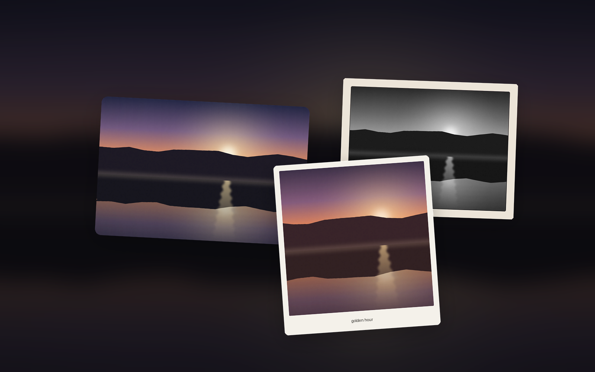

# Photo Frame

Pin a photo to your desktop, framed the way you like it.



A desktop-widget plugin for the Ryoku shell: choose any image, give it a frame
style, a soft drop shadow, and a colour filter, then drag it onto the wallpaper
beside your clock and weather. It ships with a sample photo so it looks right the
moment you enable it.

## Styles

- **Rounded** - soft rounded corners, no border (the default).
- **Square** - clean edges with a thin hairline.
- **Polaroid** - a white instant-print border with a caption strip.
- **Framed** - a gallery mat with a fine inner line.
- **Film** - a dark slide-style border.

Pick the aspect (square, 4:3, 3:2, 16:9, or portrait); the photo is cropped to fit.

## Shadow

A soft drop shadow you can switch off or tune - blur, vertical offset, and
opacity - so the print lifts off any wallpaper.

## Filters

None, Mono, Noir, Sepia, Warm, Cool, Vivid, Fade - applied live with the same
GPU effect (`MultiEffect`) the shell uses elsewhere, so there is no extra cost.

## Use it

Enable it in **Ryoku Settings -> Plugins**, choose **Desktop widget**, then on
the wallpaper: left-drag to move, drag the corner to resize, right-click for its
menu. Set the image, style, shadow, and filter from the plugin's settings.

The shell owns the draggable card, the motion, and the placement; the plugin only
supplies the framed photo.

## Settings

| Setting | What it does | Default |
|---|---|---|
| `imagePath` | Image to show; blank uses the bundled sample | `""` |
| `style` | rounded / square / polaroid / framed / film | `rounded` |
| `aspect` | 1:1 / 4:3 / 3:2 / 16:9 / 3:4 | `4:3` |
| `caption` | Caption for the polaroid / framed styles | `""` |
| `filter` | none / mono / noir / sepia / warm / cool / vivid / fade | `none` |
| `shadowEnabled` | Draw the drop shadow | `true` |
| `shadowBlur` | Shadow softness (0 - 1) | `0.55` |
| `shadowOffset` | Shadow vertical offset (px) | `8` |
| `shadowOpacity` | Shadow strength (0 - 1) | `0.45` |

Official Ryoku plugin.

## Develop

```
photo-frame/
  manifest.json           id, version, entry points, desktopWidget host
  service/Main.qml        resolves the image source + settings (with defaults)
  content/Widget.qml      the adaptive view (glyph / compact / full)
  content/PhotoFrame.qml  the styled print: mat, colour filter, drop shadow
  settings/Page.qml       options page, authored in the hub dialect
  assets/example.jpg      the bundled sample photo
```
