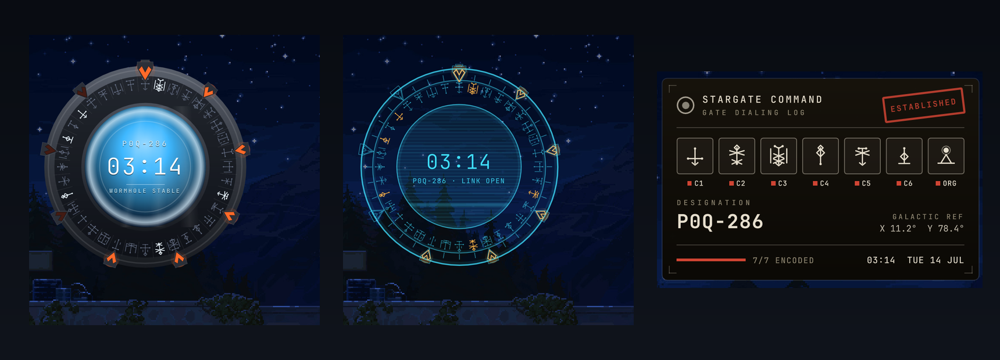

# Stargate

A living Stargate on your desktop that tells the time by dialing an address.



A desktop-widget plugin for the Ryoku shell. It reads the clock, encodes the
time into a seven-glyph gate address, and dials it: the ring turns, the chevrons
lock one by one, and the event horizon opens. On the minute it re-dials. Drag it
onto the wallpaper beside your clock and weather; it works the moment you enable
it, no font or setup required.

## Three faces

Pick one in the settings - they share the same gate, drawn three very different
ways:

- **Naquadah** - the cinematic Milky Way gate. A machined metal ring of engraved
  glyphs in segmented cells, nine chevrons that burn red as they lock, and a
  liquid event horizon with a bright meniscus and drifting caustics. An SGC
  instrument readout floats over the puddle.
- **Hologram** - the gate as an Ancient projection. Luminous cyan line-work,
  radial ticks, a drifting scan beam and a soft flicker; locked chevrons and
  their glyphs energise to amber.
- **Dossier** - the gate as a declassified SGC dialing log. A printed file with
  a rotated ink stamp (DIALING -> ESTABLISHED), a seven-cell address block with
  printed lock marks, a stencilled designation, and a galactic reference.

## Glyphs and fonts

Out of the box the ring is drawn with a built-in set of procedural glyphs - a
mirror-symmetric rune alphabet, one shape per symbol, so there is nothing to
install and no blank cells. The point of origin is always the pyramid under the
sun.

For the authentic gate symbols, add one of the Stargate address fonts from
[RafaelDeJongh/cap_resources](https://github.com/RafaelDeJongh/cap_resources)
(`resource/fonts/`). They are third-party fan fonts, so this plugin does not
bundle them - you add your own:

1. Grab a `.ttf`, e.g. `stargate_sg1.ttf`, `stargate_atlantis.ttf`,
   `stargate_universe.ttf`, or `stargate_concept.ttf`.
2. Install it for your user and refresh the cache:
   ```
   cp stargate_sg1.ttf ~/.local/share/fonts/
   fc-cache -f
   ```
3. In the widget's settings, set **Glyph set** to the matching entry (SG-1,
   Atlantis, Universe, Concept, Anquietas, or Quiver). If you would rather not
   install it, point **Glyph font file** straight at the `.ttf` path instead and
   the widget loads it live.

| Glyph set | Font family it looks for |
|---|---|
| SG-1 / Milky Way | `Stargate Address Glyphs SG1` |
| Concept / Earth origin | `Stargate Address Glyphs Concept` |
| Universe / Destiny | `Stargate Address Glyphs U` |
| Atlantis / Pegasus | `Stargate Address Glyphs Atl` |
| Anquietas / Ancient | `Anquietas` |
| Quiver | `Quiver` |

## Use it

Enable it in **Ryoku Settings -> Plugins**, choose **Desktop widget**, then on
the wallpaper: left-drag to move, drag the corner to resize, right-click for its
menu and settings. The shell owns the draggable card, the motion, and the
placement; the plugin only draws the gate.

## Settings

| Setting | What it does | Default |
|---|---|---|
| `design` | naquadah / hologram / dossier | `naquadah` |
| `mode` | clock (re-dials each minute) / date (each day) | `clock` |
| `animate` | play the dial sequence, or just show the locked address | `true` |
| `showTime` | show the digital clock | `true` |
| `showDesignation` | show the P#X-### designation and status | `true` |
| `glyphSet` | procedural / sg1 / concept / universe / atlantis / anquietas / quiver | `procedural` |
| `glyphFontPath` | a `.ttf` path (or an installed family name) that overrides the set | `""` |
| `wallustGlow` | tint the gate energy toward the wallpaper accent | `false` |

## Develop

```
stargate/
  manifest.json            id, version, entry points, desktopWidget host, settings
  service/Main.qml         the clock, the time -> address encoding, the dial state machine
  content/Widget.qml       content: selects one of the three faces
  content/gate.js          address encoding, designation, the procedural glyph grammar
  content/GateGlyph.qml    one glyph: font, procedural rune, or the point of origin
  content/GateChevron.qml  the chevron: metal housing + light, or a holo outline
  content/EventHorizon.qml the liquid puddle: meniscus, caustics, ripples, sheen
  content/FaceNaquadah.qml the cinematic gate
  content/FaceHologram.qml the projected gate
  content/FaceDossier.qml  the declassified dialing log
  assets/                  the README images
```

## Credits

Part of Ryoku, MIT-licensed. The optional gate fonts are fan-made and belong to
their authors (collected in cap_resources, originally from thescifiworld.net);
they are not distributed with this plugin.
