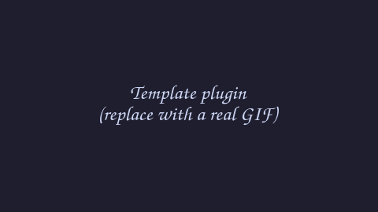

# Template Plugin

A minimal frame plugin to copy when starting your own. Hover the top-right corner of the
screen frame and a small popout slides in.



## What it does

- Shows a greeting (editable in the plugin's settings).
- Has one button that increments a counter held in the service, so the count survives the
  popout closing and reopening.

That is all it does on purpose - it is the smallest real plugin, meant to be gutted and
rebuilt into something useful.

## Install

- **Settings → Plugins → Available → Template Plugin → Install**, then enable it.

## How it plugs into the frame

The shell owns the screen frame and the hover/slide/focus behaviour. This plugin only
ships two pieces:

- `service/Main.qml` - the persistent state (the click counter). It loads once and keeps
  its value while the popout is closed. (`main` entry point.)
- `ui/Panel.qml` - the popout UI. The shell shows it when you hover the corner and hides
  it when you leave. It reads everything from the service via `pluginApi.mainInstance`.
  (`framePanel` entry point.)

The `frame` block in `manifest.json` says where the corner is: `edge: top`, `align: end`
→ the top-right corner. Change those to move it.

## Settings

| Key        | Default                       | Meaning                          |
| ---------- | ----------------------------- | -------------------------------- |
| `greeting` | `Hello from a Ryoku plugin`   | Text shown at the top of the popout |

## Develop

```
template/
  manifest.json        # id, version, entry points, frame placement
  service/Main.qml     # main: persistent state + logic
  ui/Panel.qml         # framePanel: the popout
  ui/Settings.qml      # settings page
  assets/preview.gif   # the README GIF
```

Copy this folder to `plugins/<your-id>/`, edit `manifest.json`, and rebuild the three QML
files. See `plugins/AUTHORING.md` for the full guide.

## Credits

Part of Ryoku, MIT-licensed.
