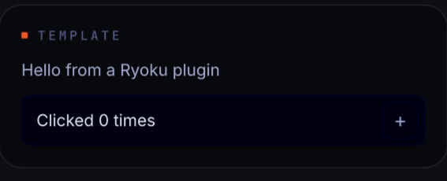

# Template Plugin

A minimal plugin to copy when starting your own. It renders as a small desktop
tile that shows a greeting and a counter.



## What it does

- Shows a greeting (editable in the plugin's settings).
- Has one button that bumps a counter held in the service, so the count
  survives the tile being hidden and shown again.

That is all it does on purpose - it is the smallest real plugin, meant to be
gutted and rebuilt into something useful.

## Install

- **Ryoku Settings -> Plugins -> Discover -> Template Plugin -> Install**, then
  enable it.

## How it plugs in

The shell owns the host surface (a draggable desktop tile here) and the
placement, drag, and resize behaviour. This plugin ships two pieces:

- `service/Main.qml` - the persistent state (the click counter). It loads once
  and keeps its value while the tile is hidden. (`main` entry point.)
- `content/Widget.qml` - the view. The host mounts it, sets `density`, `s`,
  `widthBudget` and `active`, then lays out at the size it reports. It reads
  everything from the service via `pluginApi.mainInstance`. (`content` entry
  point.)

`hosts` in `manifest.json` lists where it can render (`desktopWidget` here);
`defaults.host` is where it lands when first enabled.

## Settings

| Key        | Default                     | Meaning                            |
| ---------- | --------------------------- | ---------------------------------- |
| `greeting` | `Hello from a Ryoku plugin` | Text shown at the top of the tile  |

Settings are declared as the `metadata.settings` schema in `manifest.json`; the
shell renders the form and persists changes to `pluginApi.pluginSettings`.

## Develop

```
template/
  manifest.json             # id, version, entry points, hosts, settings schema
  service/Main.qml          # main: persistent state + logic
  content/Widget.qml        # content: the adaptive view
  assets/preview-widget.png # the README image
```

Copy this folder to `plugins/<your-id>/`, edit `manifest.json`, and rebuild the
two QML files. See `plugins/AUTHORING.md` for the full guide.

## Credits

Part of Ryoku, MIT-licensed.
