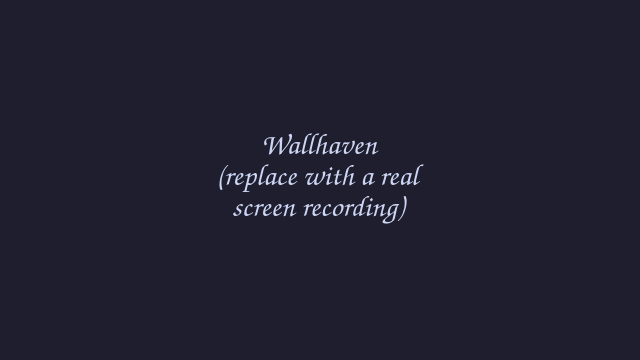

# Wallhaven

Browse [wallhaven.cc](https://wallhaven.cc) and set wallpapers without leaving the desktop.
Hover the top-right corner of the screen frame and the popout slides in.



## What it does

- Search wallhaven by keyword, or pull the top wallpapers of the week / month.
- Page through results in a 3×3 grid of thumbnails.
- Right-click a thumbnail (or the menu button) to open it on the web, download it, or
  set it as the wallpaper.

## Install

- **Settings → Plugins → Available → Wallhaven → Install**, then enable it. Or
- install the **The Ricer** extras bundle, which includes this plugin.

An optional Wallhaven API key (Settings → Plugins → Wallhaven → ⚙) raises the request
rate limit; it is sent only to wallhaven.cc.

## How it plugs into the frame

The shell owns the screen frame and the hover/slide/focus behaviour. This plugin only
ships two pieces:

- `service/Main.qml` — the search and download logic. It loads once and keeps results
  while the popout is closed. (`main` entry point.)
- `ui/Panel.qml` — the popout UI. The shell shows it when you hover the corner and hides
  it when you leave. It reads everything from the service via `pluginApi.mainInstance`.
  (`framePanel` entry point.)

The `frame` block in `manifest.json` says where the corner is: `edge: top`, `align: end`
→ the top-right corner. That is the whole integration.

## Settings

| Key      | Default | Meaning                                   |
| -------- | ------- | ----------------------------------------- |
| `apiKey` | `""`    | Optional wallhaven.cc API key (rate limit) |

## Develop

```
wallhaven/
  manifest.json              # id, version, entry points, frame placement
  service/Main.qml           # main: search/download logic
  ui/Panel.qml               # framePanel: the popout
  ui/Settings.qml            # settings page
  bin/ryoku-wallhaven-search # the search/download command
  assets/preview.gif         # the README GIF
```

Copy `plugins/template/` to start a new plugin. See `plugins/AUTHORING.md` for the full
guide on building frame plugins.

## Credits

Wallpapers and the search API come from [wallhaven.cc](https://wallhaven.cc). The plugin
code is part of Ryoku and is MIT-licensed.
