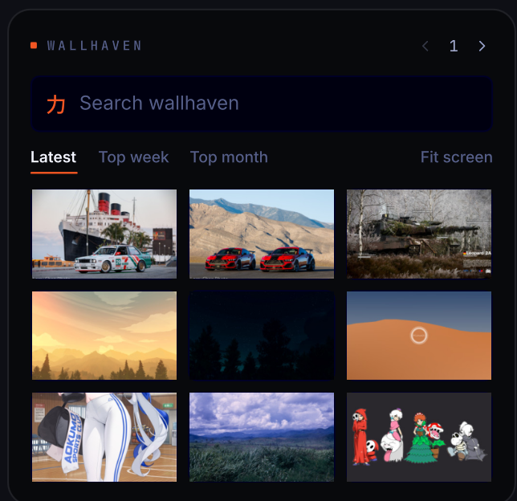

# Wallhaven

Browse [wallhaven.cc](https://wallhaven.cc) and set your wallpaper, straight from
the desktop.



## What it does

A wallpaper browser that lives on your wallpaper, next to the clock and weather:

- Search wallhaven.cc, or browse the latest and the top of the week or month.
- "Fit screen" filters to your monitor's aspect, so what you set actually fits.
- Page through results; the page, query, and filters stay put when you drag the
  tile aside to see the wallpaper behind it.
- Click a thumbnail to download it and set it as your wallpaper (the tile marks
  the one it's working on); right-click to open it on wallhaven.cc.

## Install

**Ryoku Settings -> Plugins -> Discover -> Wallhaven -> Install**, then enable it.
Drag it where you like and scale it from the corner bracket, same as the clock.

## How it plugs in

The shell hosts it as a desktop-widget tile; the plugin supplies the view and the
search logic:

- `service/Main.qml` - the search and download logic. It loads once and keeps the
  results, page, and filters alive while the tile is moved or hidden. (`main`.)
- `content/Widget.qml` - the tile. It reads everything from the service and
  reports its size so the host can place it. (`content`.)
- `bin/ryoku-wallhaven-search` - the small CLI that talks to the wallhaven.cc API
  (needs `curl` and `jq`). Setting a wallpaper goes through `ryoku-shell`.

## Settings

| Key      | Default | Meaning                                                       |
| -------- | ------- | ------------------------------------------------------------- |
| `apiKey` | empty   | Optional wallhaven.cc API key. Raises rate limits and unlocks NSFW per your account; anonymous browsing works without it. |

## Develop

```
wallhaven/
  manifest.json              # id, version, host, settings schema
  service/Main.qml           # main: search + download logic
  content/Widget.qml         # content: the desktop tile
  bin/ryoku-wallhaven-search # the wallhaven.cc CLI
  assets/preview-widget.png  # the README image
```

See `plugins/AUTHORING.md` for the plugin model.

## Credits

Official Ryoku plugin, MIT-licensed. Wallpapers and the API are from
[wallhaven.cc](https://wallhaven.cc).
